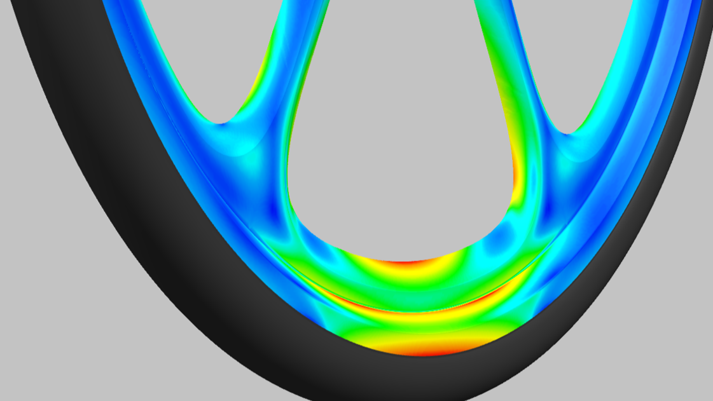

    
    

        
    

# Hey there, I'm David 👋

## Full-Stack Developer | React - Next.js - Node.js | Currently building scalable web applications

🏠 Based in Jávea, Spain • 📧 estdav@protonmail.com • 🔗 [LinkedIn](https://www.linkedin.com/in/david-de-esteban)

My name is David, and I come from a background as Mechanical Engineer designing and calculating systems for trains and locomotives.

### About Me
Mechanical Engineer turned Full-Stack Developer with 3+ years building scalable web and mobile applications. I specialize in React ecosystem and love creating user-centric solutions for startups and growing companies.

### 🛠️ Tech Stack
| Core Languages | Frontend | Backend | Dev Tools | AI Tools | Web3 |
|---|---|---|---|---|---|
|  |  |  |  |  |  |
|  |  |  |  |  |  |
|  |  |  |  |  |  |

## 🚀 What I'm Building Now
### [**Pop In Home**](https://www.popinhome.com/en 'Pop In Home web app page')

#### Pop In Home is an AI-powered real estate platform bringing more transparency and quality of information for home buyers

    The Pop In Home App consists of a web app, an iOs app, and a web admin panel. It allows users to browse properties with high potential of revaluation after renovation.

    A subscription to the app grants access to detailed architectural, interior design, legal, financial, rental and engineering reports on the properties.

  
    
The app is supported by an <strong>Admin Panel</strong> which streamlines the process of feeding data into the app.

    
My role in this project has covered, among others, the following tasks:

    <ul>
        <li>
            Built <strong>admin panel from scratch</strong> with scalable architecture patterns
        </li>
        <li>
            Integrated <strong>AI chat functionality</strong> for automated property reports (architecture, design, engineering)
        </li>
        <li>
            Implemented <strong>Stripe payment processing</strong> for seamless transactions
        </li>
        <li>
            Developed <strong>comprehensive test suite</strong> ensuring 95%+ code coverage
        </li>
        <li>
            Collaborated across <strong>full-stack teams</strong> bringing Figma designs to production
        </li>
    </ul>

  

 

### [Montgó BVC Bizum payments](https://v0-mbvc-bizum-git-main-davids-projects-cdae2392.vercel.app/ 'Montgó Beach Volley Club Bizum payments page')

This is a one-week personal project.
  
 
On my spare time I run, along with my wife and 2 other people, a beach volleyball club, the [Montgó Beach Volley Club](https://montgobvc.com/ 'Montgó Beach Volley Club Homepage'). The coaches in the club were receiving a lot of payments through the Spanish mobile instant payments system Bizum.  
This situation was not ideal, since made accounting quite cumbersome, and more important, might put the coaches unnecessarily under scrutiny by the Spanish tax authority.
  
So I decided to create this simple payment form, integrated with the Spanish gateway for payments, Redsys.

 

 

## 💾 Past Projects
### [Pura Vida App](https://github.com/EstDavid/pura-vida-app 'Pura Vida App Github Repository')

#### App for planning your activities in a Spiritual Festival
There can be lots of very enriching and transforming activities and events to attend at a Spiritual Festival
This App allows you to choose an plan your activities, get around the different areas, find the healers you will visit.
It stores the information in the phone's local storage so you don't have to worry about poor internet connections

  

  

### [Delta Radar](https://github.com/EstDavid/delta-radar 'Delta Radar Github repository')

#### Web featuring the best potential trades of a Defi trading bot

Delta Radar is a frontend app which shows potential profitable arbitrage trades accross different token pools in Decentralized Exchanges (DEX)
This frontend is a <strong>small part of a broader project</strong> which is aimed at creating a <strong>trading bot</strong> capable of:
<ul className="list-group list-group-flush">
    <li className="list-group-item">Scanning token pools accross different DEXs</li>
    <li className="list-group-item">Finding price differences which yield a profit</li>
    <li className="list-group-item">Calculating the optimum amount of the first token in the trade sequence</li>
    <li className="list-group-item">Triggering a smart contract with flash loan capabilities which attempts to catch the potential profit</li>
</ul>
        
The app displays the historic output from the trading bot scanner module and allows to search and filter past potential trades, according to criteria such as profitability, date, token or exchange 

  

  

### [Unicharts](https://github.com/EstDavid/uniswapv3-charts 'Unicharts Github repository')
#### Charting app that reads price data from Uniswap V3 pools

The app is composed of a frontend and a backend. The backend retrieves data from Uniswap V3 pools and stores it on a database.
The frontend reads the historical price data from the database and generates the charts
It features easy search of coin pairs, visualization of charts in different timeframes and use of EMA and SMA averages

View frontend repository [here](https://github.com/EstDavid/uniswapv3-charts 'Unicharts frontend github repository')

View backend repository [here](https://github.com/EstDavid/UniswapV3OracleReader 'Unicharts backend github repository')

  

### [Dolphinance](https://github.com/EstDavid/DappExchange 'Dolphinance Github repository')
#### Exchange Dapp with its own ERC-20 token

Both corresponding smart contracts were deployed on the Rinkeby network.

Dolphinance is an exchange Dapp based on the capstone project from the <a 
    href="https://www.dappuniversity.com/" target="_blank" rel="noreferrer noopener" >
Dapp University</a> Blockchain Developer Program

The dapp allows <strong>buying and selling</strong> the native token of the exchange, <strong>deposits and withdrawals</strong>
<strong>placing limit orders</strong> and tracking token price
  

  

### Projects as mechanical engineer
As mechanical engineer I spent more than 15 years designing and calculating complex mechanical systems for the rolling stock industry (trains, locomotives, trams...)

<!--
**EstDavid/EstDavid** is a ✨ _special_ ✨ repository because its `README.md` (this file) appears on your GitHub profile.

Here are some ideas to get you started:

- 🔭 I’m currently working on ...
- 🌱 I’m currently learning ...
- 👯 I’m looking to collaborate on ...
- 🤔 I’m looking for help with ...
- 💬 Ask me about ...
- 📫 How to reach me: ...
- 😄 Pronouns: ...
- ⚡ Fun fact: ...
-->
