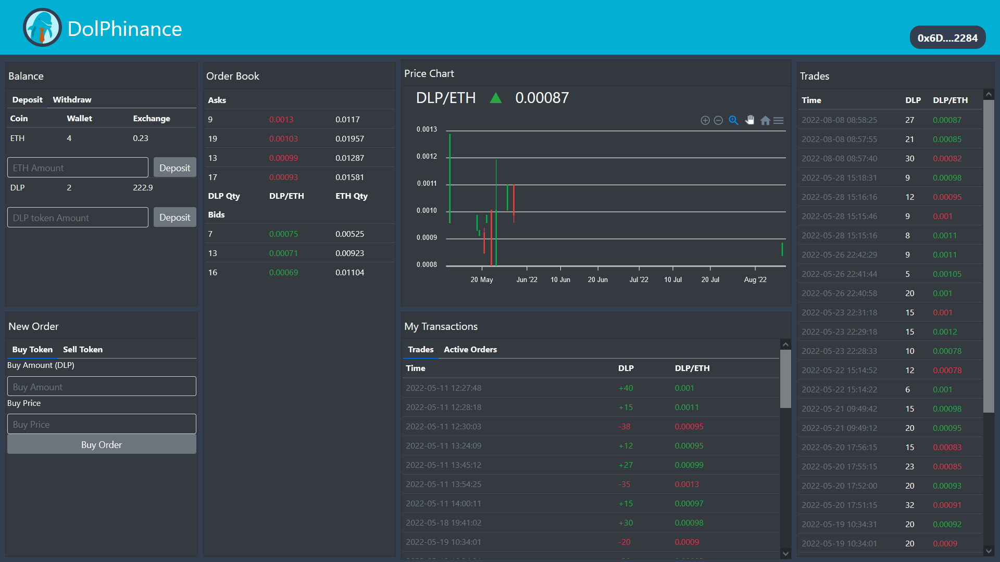

    
    

        
    

### Hey there, this is David 👋

In 2021 I took my interest for crypto to a new level and became a blockchain developer, after being in the crypto space since early 2018 as an investor and a trader.

I'm currently finishing the latest projects I was working on as I embarked on the journey of blockchain development.

## Projects
### [Dolphinance](http://dlp-token-exchange.herokuapp.com/ "Dolphinance live demo")
Exchange Dapp with its own ERC-20 token

Both corresponding smart contracts are deployed on the Rinkeby network <a 
    href="https://rinkeby.etherscan.io/address/0x6723e472b9de9b329f344aa6c8dc80e67db92de8" target="_blank" rel="noreferrer noopener" >here (Dapp)
    </a> and <a 
    href="https://rinkeby.etherscan.io/address/0x664c8fcf50a588d3208c729362685ea911522198" target="_blank" rel="noreferrer noopener" >here (ERC-20 token)</a>

Dolphinance is an exchange Dapp based on the capstone project from the <a 
    href="https://www.dappuniversity.com/" target="_blank" rel="noreferrer noopener" >
    Dapp University</a> Blockchain Developer Bootcamp

The dapp allows <strong>buying and selling</strong> the native token of the exchange, <strong>deposits and withdrawals</strong>
<strong>placing limit orders</strong> and tracking token price

View repository [here](https://github.com/EstDavid/DappExchange "Dolphinance github repository")

### [Unicharts](http://uniswapv3-charts.herokuapp.com/ "UniCharts live demo")
Charting app that reads price data from Uniswap V3 pools. 

The app is composed of a frontend and a backend. The backend retrieves data from Uniswap V3 pools and stores it on a database.
The frontend reads the historical price data from the database and generates the charts
It features easy search of coin pairs, visualization of charts in different timeframes and use of EMA and SMA averages

View frontend repository [here](https://github.com/EstDavid/uniswapv3-charts "Unicharts frontend github repository")

View backend repository [here](https://github.com/EstDavid/UniswapV3OracleReader "Unicharts backend github repository")

## Skills
### Languages
+  Solidity
+  Javascript
+  Python
+  Typescript

### Blockchain related
+ Truffle and Ganache
+ Hardhat
+ Ether.js
+ Flash swaps
+ Trading bots
+ NFTs

### Frameworks and tools
+  React
+  Redux 
+  Node.js 
+  Bootstrap
+  Git
+  VS Code

          

<!--
**EstDavid/EstDavid** is a ✨ _special_ ✨ repository because its `README.md` (this file) appears on your GitHub profile.

Here are some ideas to get you started:

- 🔭 I’m currently working on ...
- 🌱 I’m currently learning ...
- 👯 I’m looking to collaborate on ...
- 🤔 I’m looking for help with ...
- 💬 Ask me about ...
- 📫 How to reach me: ...
- 😄 Pronouns: ...
- ⚡ Fun fact: ...
-->
